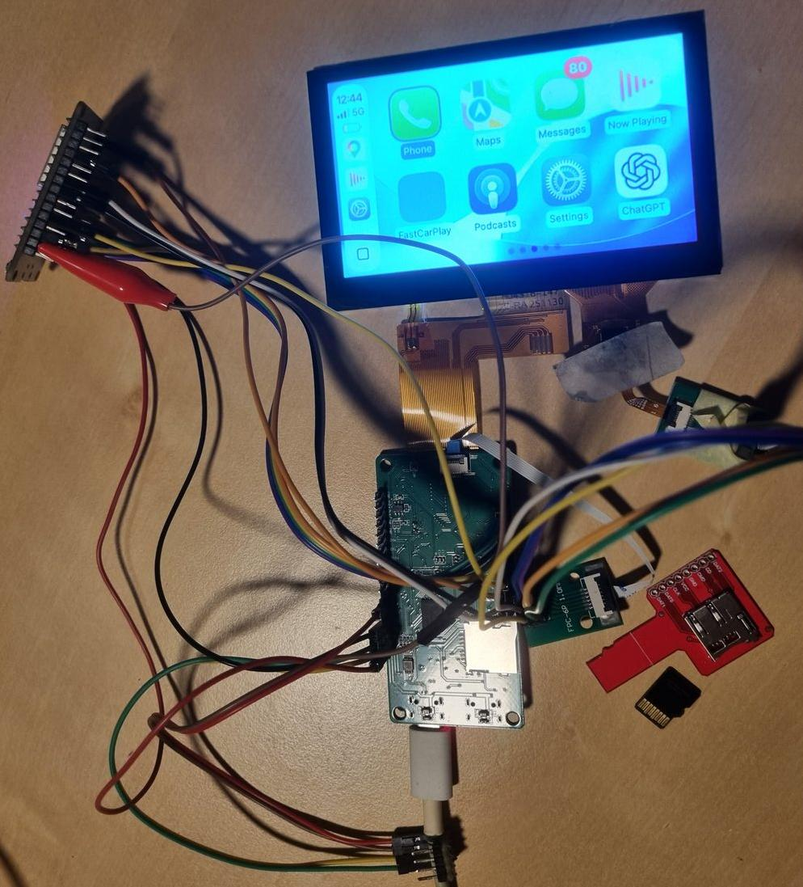
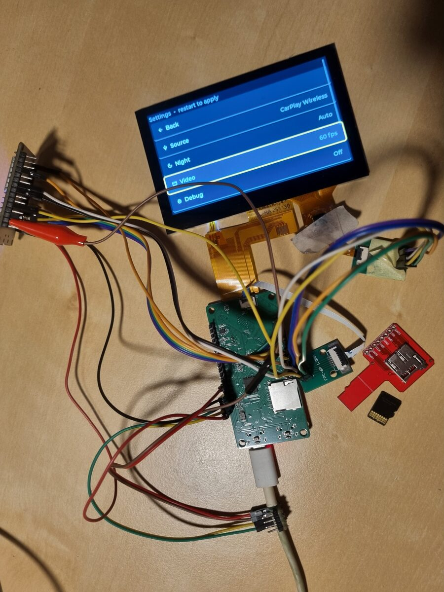
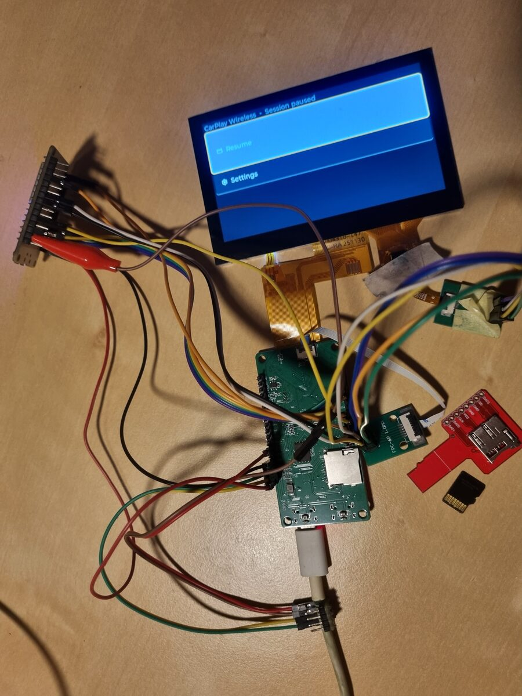

# f1c200s-linux

[](https://github.com/mbt28/f1c200s-linux/actions/workflows/build-image.yml)

Mainline-Linux + Buildroot for the **Lctech Pi F1C200s** (Allwinner F1C200S /
suniv, ARM926EJ-S / ARMv5TE, 64 MiB DDR, 480×272 LCD) — a wireless **CarPlay /
Android-Auto** receiver.



| FastCarPlay settings | CarPlay session paused |
|:---:|:---:|
|  |  |

**Patch-only:** this repo ships the scripts, patches, configs and docs that
fetch the Linux kernel and Buildroot from upstream and apply our customizations
— it does not vendor those trees. Hardware H.264 decode uses mainline **cedrus**
(V4L2 stateless, blob-free) — hardware-validated, colour-correct, no freezes.
The Allwinner `cedar`/ION blob path was dropped once cedrus was proven; details
in `docs/cedrus-status.md` and `docs/kernel-6.18-upgrade.md`.

## Branches

| branch | kernel | state |
|---|---|---|
| `main` | 6.6.143 | **stable** — every commit hardware-validated; releases tagged here |
| `dev` | 6.6.143 | integration; CI builds a flashable image per push |
| `kernel-6.6` | 6.6.143 | cedrus-only (cedar/ION blob path removed) |
| `kernel-6.18` | 6.18.42 | 6.18 kernel; adds boot from on-board NAND (squashfs + UBIFS overlay) |
| `kernel-7.1` | 7.1.2 | parallel 7.1 track — open: freezes under decode (a 7.1 regression) |

Short-lived `feature/*` branches (e.g. `feature/spi-dma`) hang off `dev`. Every
push to a build branch gets a CI-built `sdcard.img` (Actions → run → Artifacts);
`v*` tags attach it to a Release. Workflow and release steps: `docs/development.md`.

## Quickstart

```sh
git clone https://github.com/mbt28/f1c200s-linux.git
cd f1c200s-linux
scripts/fetch-sources.sh      # clone Buildroot (pinned) + the cedar driver
scripts/build.sh              # fetch Linux + U-Boot, build the image
sudo dd if=output/images/sdcard.img of=/dev/sdX bs=1M conv=fsync   # your SD device!
```

Versions are pinned in `config.env`; any Buildroot target is forwarded, e.g.
`scripts/build.sh menuconfig` or `scripts/build.sh linux-rebuild`.

## Layout

This repo root is the Buildroot `BR2_EXTERNAL` tree.

```
config.env                 pinned versions + upstream URLs
scripts/                   fetch-sources.sh · build.sh
configs/…_defconfig        the board defconfig
board/lctech/pi-f1c200s/   linux/uboot fragments · genimage · post-build · flash-nand.sh
patches/linux-lctech/      LCD+GT911 touch · VE clocks · USB-OTG host · cedrus suniv fixes
patches/ffmpeg/            v4l2-request hwaccel
package/                   fastcarplay · esp-hosted-ng · libimobiledevice stack
rootfs-overlay/            init scripts (cedrus · usb-gadget · wifi/ap · carplay) + autorun
docs/                      display · hardware-fixes · cedrus-status · …
```

Upstream sources land in `buildroot/` and `output/` (both git-ignored).

## Boot: SD card, or on-board NAND

The `sdcard.img` boots from an SD card. On `kernel-6.18` the board can also boot
from its on-board **128 MiB SPI NAND**, giving a self-contained device with a
**writable, persistent root**: a read-only squashfs (lower) unioned with a UBIFS
overlay (upper) via overlayfs, assembled by `/preinit`. CI emits a
`nand-bundle.tar.gz` next to the SD image; flash it with `flash-nand.sh` from an
SD boot (kernel + rootfs to NAND, the vendor bootloader kept).

> **NAND is a workaround, and SPI NOR is preferred.** Mainline U-Boot's SPL
> cannot boot SPI NAND on suniv, so the board keeps the **vendor bootloader**
> (with a one-time `bootm_size` env patch), and SPI NAND needs **UBIFS** to dodge
> a bad-block-marker conflict on this chip. SPI NOR has none of this — mainline
> boots it directly from the SPL, no bad blocks, no vendor bootloader — so the
> plan is to **move to a NOR flash chip** in the future.

## Runtime controls

All of these run on the board and **persist across reboots**:

```sh
net on | off | status        # eth0/usb0 + dropbear (SSH) — off by default
autorun on | off | status    # FastCarPlay boot autostart (log: /tmp/carplay.log)
carplay                      # run FastCarPlay manually (replaces a running instance)
echo 03-tux > /etc/splash-theme   # boot splash — 10 themes in /etc/splash/
```

## USB OTG: host (default) ⇄ gadget

The Type-C port is **host mode by default** (`patches/linux-lctech/0004`),
driving the CarPlay/Android-Auto dongle and/or a USB-Ethernet adapter.

> ⚠ VBUS is tied to the board Vin — **power the board from a second source**
> when hosting a device.

For **gadget mode** (one Type-C cable = power + a `usb0` link to a dev host), set
`dr_mode = "peripheral"`; `S42usb-gadget` brings up `usb0` at `192.168.8.2`.

## Networking / SSH (opt-in)

`net on` starts dropbear (key auth — put your public key in
`rootfs-overlay/root/.ssh/authorized_keys` **before building**). With a
USB-Ethernet adapter in the OTG port, `eth0` comes up (DHCP, else
`192.168.7.2/24`) and prints its address on the serial console:

```
============ eth-dev: eth0 = <ip>   (ssh root@<ip>) ============
```

Built-in USB-NIC drivers: DM9601, AX8817x, AX88179, CDC-ECM, SMSC95xx. File
transfer is `ssh … cat` (no scp/sftp) or `rz`/`sz` over serial. OTG switch and
the rest of the board gotchas: `docs/hardware-fixes.md`.

## Versions

Pinned in `config.env` / the defconfig. This branch (`kernel-6.18`): Linux
**6.18.42** · Buildroot **2026.05** · U-Boot **2026.07**. Stable `main`: Linux
**6.6.143** · U-Boot **2026.04**.
